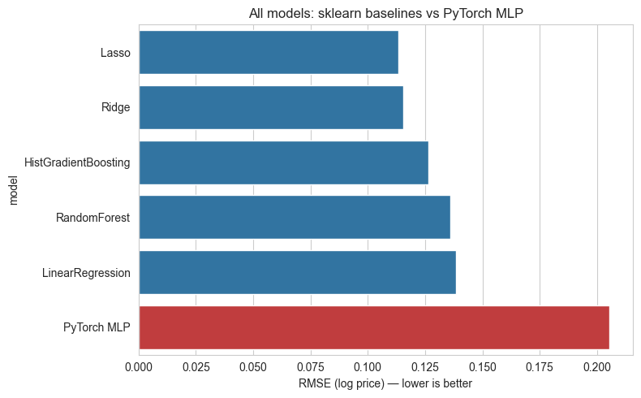
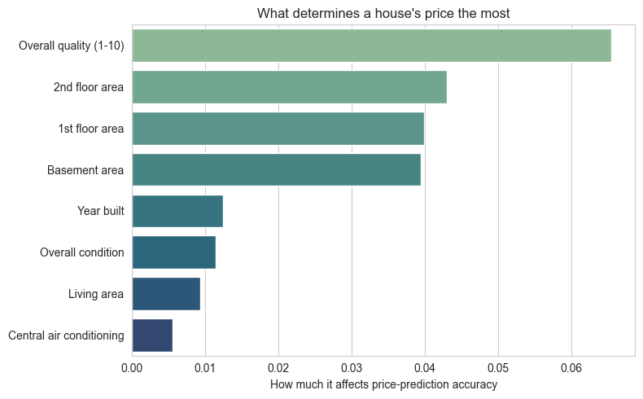
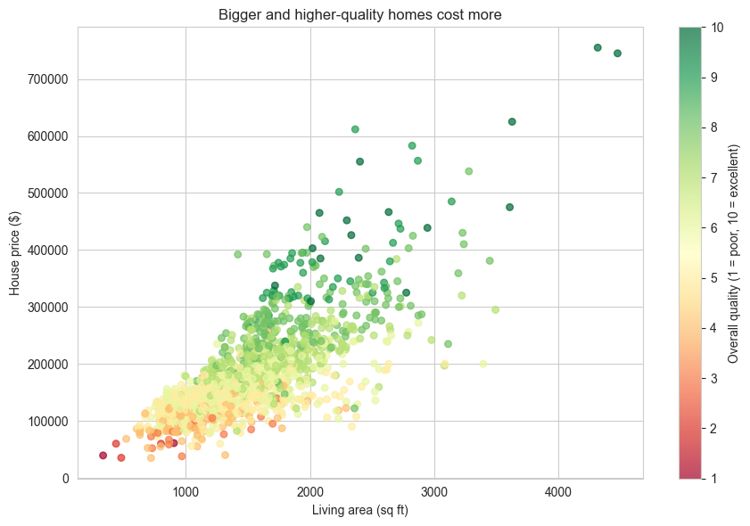
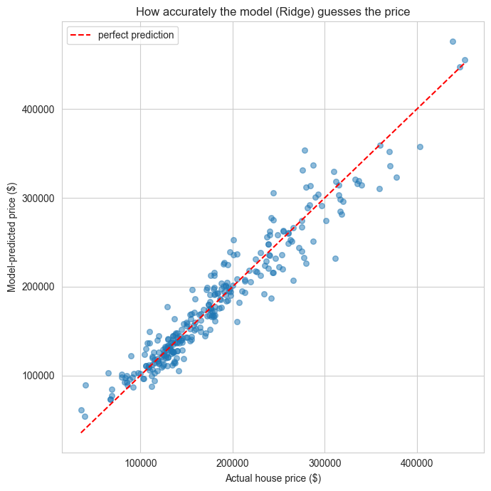

# Real Estate Price Prediction Model

End-to-end pipeline that predicts residential property prices on the [Ames Housing dataset](https://www.kaggle.com/competitions/house-prices-advanced-regression-techniques) (~1,460 homes, 80+ features): data cleaning, missing-value imputation, feature engineering, regularized linear models, tree ensembles, a PyTorch neural network, and feature-importance interpretation.

## Results

5-fold cross-validated performance, target = `log1p(SalePrice)` (the Kaggle competition metric):

| Model | RMSE (log price) | MAE ($) | R² |
|---|---|---|---|
| **Lasso** (α=0.0005) | **0.1134** | 13,931 | 0.9324 |
| Ridge (α=20) | 0.1154 | 14,090 | 0.9318 |
| HistGradientBoosting | 0.1263 | 15,260 | 0.9043 |
| RandomForest | 0.1360 | 16,688 | 0.8919 |
| LinearRegression | 0.1386 | 15,680 | 0.8609 |
| PyTorch MLP | 0.2054 | 25,742 | 0.5633 |



**Regularized linear models beat both tree ensembles and the neural network** on this dataset. That's not a bug — with ~1,450 rows and 251 one-hot-expanded features, a plain MLP overfits/underfits relative to models with built-in regularization (L1/L2, tree splits). It's a deliberate, honest finding from Stage 4: gradient boosting and regularized linear regression outperform a from-scratch MLP on small tabular data, which is itself a useful conclusion about when deep learning is (and isn't) the right tool.

### What actually drives price

Permutation importance (computed on held-out data, on the *original* raw columns so a categorical like `Neighborhood` is scored as a single feature rather than 25 one-hot dummies):



- **Quality** (`OverallQual`) is the single strongest driver across every model tested.
- **Size** matters just as much in aggregate, but the signal splits across several correlated raw columns (`1stFlrSF`, `2ndFlrSF`, `TotalBsmtSF`, `GrLivArea`) — a textbook multicollinearity effect: permuting one size column barely hurts predictions because the others still carry most of the same information. The engineered `TotalSF` feature (and its Ridge coefficient, tied with `OverallQual`) makes this much more visible than any single raw column.
- **Location** (`Neighborhood`) matters, but its *marginal* contribution is smaller than a naive "location, size, quality" story would suggest — likely because neighborhood already correlates heavily with house size and quality, so much of its effect is absorbed by those features.




## Stack

- **Pandas / NumPy** — data cleaning, feature engineering
- **Matplotlib / Seaborn** — EDA and results visualization
- **scikit-learn** — `Pipeline` + `ColumnTransformer` preprocessing, `GridSearchCV`, Ridge/Lasso/RandomForest/HistGradientBoosting, `permutation_importance`
- **PyTorch** — MLP baseline, trained with early stopping and gradient clipping
- **Jupyter** — EDA and results notebooks

## Project structure

```
├── data/                              # train.csv / test.csv (Kaggle, gitignored)
├── notebooks/
│   ├── 01_eda.ipynb                   # target distribution, missing values, correlations, outliers
│   ├── 02_modeling.ipynb              # sklearn baselines + PyTorch MLP, CV comparison
│   └── 03_interpretation.ipynb        # feature importance, permutation importance, plain-language charts
├── reports/figures/                   # exported charts used in this README
├── src/
│   ├── preprocessing.py               # FeatureBuilder + ColumnTransformer pipeline (no leakage across CV folds)
│   ├── train_sklearn.py               # Ridge/Lasso/RandomForest/HistGradientBoosting comparison
│   ├── train_pytorch.py               # MLP training + CV evaluation
│   └── interpret.py                   # feature-name mapping, permutation importance helpers
├── requirements.txt
└── README.md
```

## Approach

**Preprocessing** (`src/preprocessing.py`): columns where `NaN` structurally means "feature absent" (no garage, no basement, no pool) are filled with `"None"`/`0`; `LotFrontage` is imputed with the per-neighborhood median (learned in `fit`, applied in `transform`, so no fold leaks into another). Engineered features include `TotalSF`, `TotalBath`, `HouseAge`, and has-pool/fireplace/garage/basement flags. Quality scales (`ExterQual`, `KitchenQual`, ...) are ordinal-encoded (`None < Po < Fa < TA < Gd < Ex`); nominal categoricals (`Neighborhood`, `RoofStyle`, ...) are one-hot encoded. Everything is wrapped in a single `sklearn.pipeline.Pipeline`, so `fit` only ever sees the training fold during cross-validation.

**Baselines** (`src/train_sklearn.py`): Ridge/Lasso alpha is tuned with `GridSearchCV` (5-fold), RandomForest/HistGradientBoosting get a small hyperparameter grid. All five models are scored with `cross_val_predict` on the same 5 folds for a fair, out-of-fold comparison (RMSE on log price, plus MAE/R² on dollar price after `expm1`).

**Neural network** (`src/train_pytorch.py`): `Linear(n, 256) → ReLU → Dropout(0.3) → Linear(256, 64) → ReLU → Linear(64, 1)`, trained with `MSELoss` on log price, Adam (`lr=1e-3`), batch size 64, early stopping on a 10% validation split, evaluated with the same 5-fold CV scheme as the sklearn models. Gradient clipping (`max_norm=5.0`) was added after an outlier in `MiscVal` (~$15,500 vs. mostly $0) produced a z-score of ~28 post-scaling and destabilized training.

**Interpretation** (`src/interpret.py`, `notebooks/03_interpretation.ipynb`): feature importance from RandomForest, Ridge coefficients, and `permutation_importance` computed on held-out data through the full pipeline on raw (pre-encoding) columns — the most interpretable and most reliable of the three.

## Setup

```bash
python3 -m venv venv
source venv/bin/activate
pip install -r requirements.txt
```

Download `train.csv` / `test.csv` from the [Kaggle competition page](https://www.kaggle.com/competitions/house-prices-advanced-regression-techniques/data) into `data/`, then run the notebooks in order (01 → 02 → 03), or:

```bash
python3 src/train_sklearn.py
python3 src/train_pytorch.py
```
